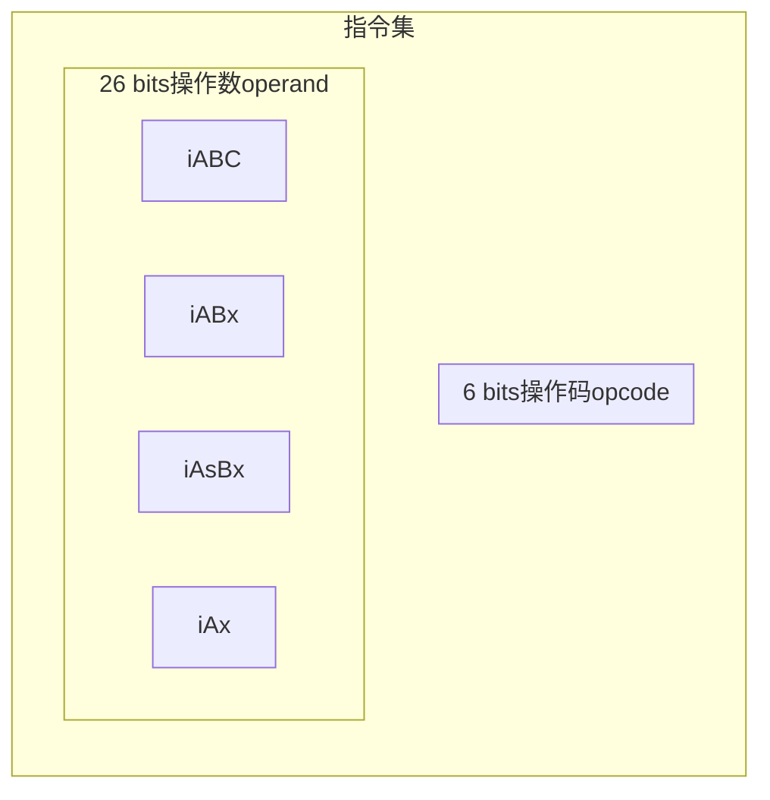
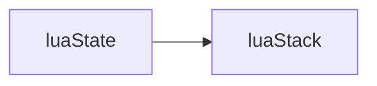
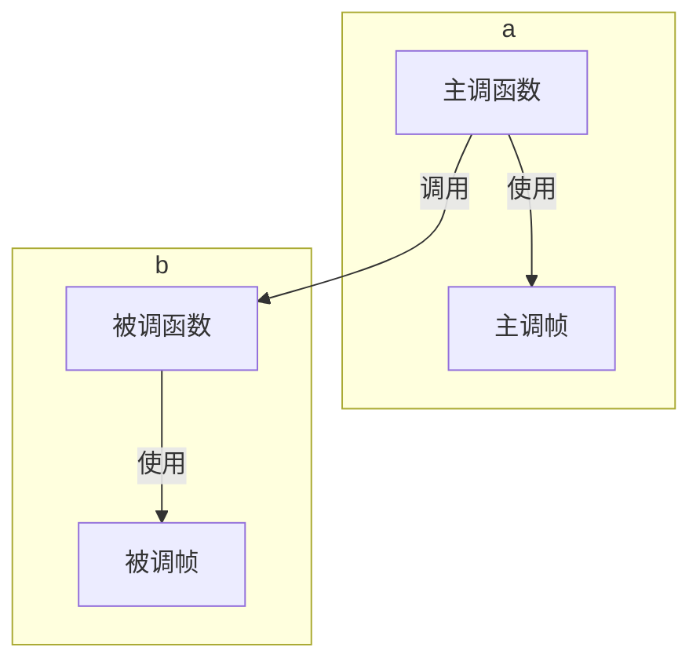
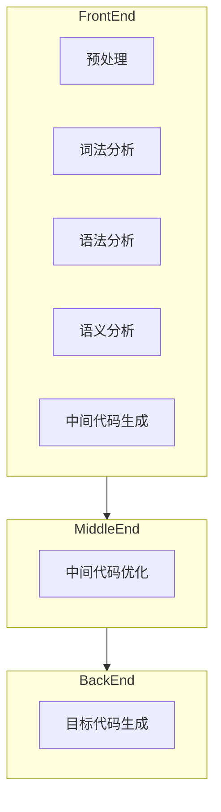
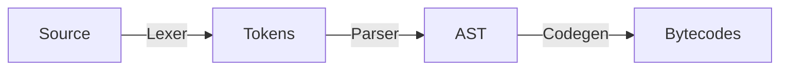
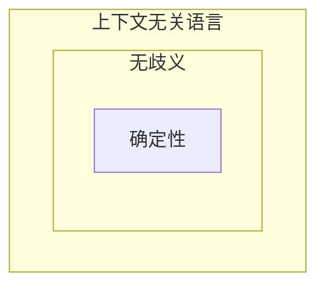
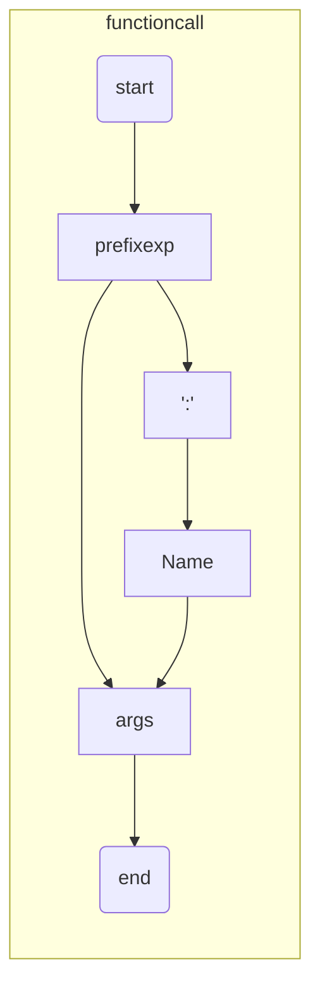
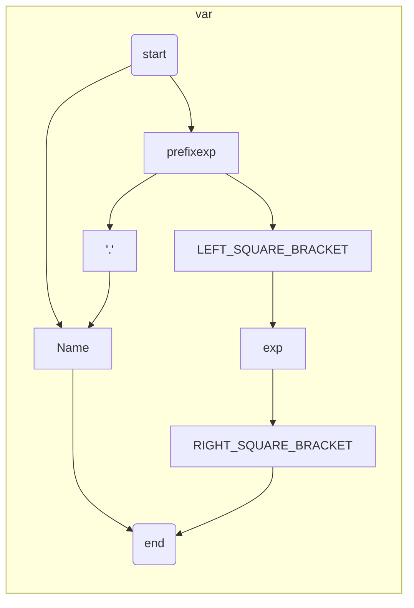

# javalua

## 第一部分 准备

### 第1章 准备工作

Use Java to write lua interpreter

学习 [自己动手实现Lua](https://book.douban.com/subject/30348061/)

环境：
* Java 11
* maven 3.6.3

为了简化代码，用了 lombok，如果运行测试失败，需要maven clean一下再跑

工具：

* 反编译 https://youtu.be/2LPaqYFPrfY https://github.com/viruscamp/luadec
* `luac53 -l -`，然后输入lua代码，按`Ctrl + Z`结束输入，可以得到反编译后的结果

## 第二部分 Lua虚拟机和Lua API

### 第2章 二进制chunk

如果luac指定了`-s`，那么行号表，局部变量表和Upvalue表，不会生成在chunk中，它们都是调试信息

书里用的lua版本是5.3.4 由于5.4的header发生变动，因此踩了坑，所以这里代码也改为实现5.3

截至commit [e354c6355e7f48e087678ec49e340ca0696725b1](https://github.com/lua/lua/tree/e354c6355e7f48e087678ec49e340ca0696725b1)

lua的官方实现中，文件如下

* lua.h 常量
* ldump.c 编码实现
* lundump.c 解码实现
* lobject.h 数据结构

本机也是little endian 小端

最终的效果是，可以读取官方编译器编译出来的chunk文件

### 第3章 指令集

基于栈（Stack Based）的虚拟机：Java虚拟机、.NET CLR、Python虚拟机、Ruby YARV虚拟机

基于寄存器（Register Based）的虚拟机：安卓早期的Dalvik虚拟机，Lua虚拟机

Lua 5.0 之前是基于栈的虚拟机，5.0 开始改成了基于寄存器的虚拟机

指令集（Instruction Set）

* 定长（Fixed-width）指令集
* 变长（Variable-width）指令集

Lua用定长（Fixed-width）指令集，每条指令占4个字节，低6比特放操作码（Opcode），其余26比特放操作数（Operand）

Lua 5.3 有47条指令，6大类

* 常量加载
* 运算符
* 循环和跳转
* 函数调用
* 表操作
* Upvalue操作

4种编码模式（Mode）

* iABC：B+C+A
* iABx：Bx+A
* iAsBx：sBx+A
* iAx：Ax

| 操作数 | 占用的比特 | 介绍                             |
| ------ | ---------- | -------------------------------- |
| A      | 8          |                                  |
| B      | 9          |                                  |
| C      | 9          |                                  |
| Bx     | 18         |                                  |
| sBx    | 18         | 只有这个操作数被解释成有符号整数 |
| Ax     | 26         |                                  |

sBx可以理解成signed Bx，即有符号的Bx

操作码（Opcode）只有6位，最多产生64条指令

Lua 5.3 有 47 条，从0到46




坑记录：

byte -128 转为 int 时，如果写成

```java
byte byteValue = -128;
int intValue = byteValue;
```

intValue也是-128，但是底层的bits 从 

1000 000 

变成 

1000 0000 0000 0000 0000 0000 0000 0111，

发生重大变化，和期望的 

0000 0000 0000 0000 0000 0000 1000 000 不一样，

不应该强转，应该用 Byte.toUnsignedInt 方法来转换

### 第4章 Lua API

Lua API主要指一系列以 "lua_" 开头的C语言函数

Lua 3.1 引入 lua_State 结构体，来满足宿主环境需要同时使用多个Lua解释器实例的场景

Lua栈是宿主语言（对官方来说是C语言，对书里的示例来说是Go语言，对本工程来说是Java语言）和Lua语言进行沟通的桥梁

Lua栈里存放的是Lua值

Lua是动态类型语言，Lua代码里，变量不携带类型信息，变量的值才携带类型信息

Lua的8种数据类型：

* nil
* 布尔（boolean）
* 数字（number）
* 字符串（string）
* 表（table）
* 函数（function）
* 线程（thread）
* 用户数据（userdata）

使用type函数可以获取变量的类型

基础的类型是：nil，布尔，数字和字符串。在Java层面，可以用[Primitive Data Types](https://docs.oracle.com/javase/tutorial/java/nutsandbolts/datatypes.html)来表示，但是这个工程为了可读性，统一用reference type来表示，也就是每个类型都可以找到对应的class

当提供给Lua API一个无效索引时，那么这个无效索引对应的值的类型就是LUA_TNONE




### 第5章 Lua 运算符

25个运算符

* 8个算术运算符：`+ - * / // % ^`注意Lua里的整除（Floor Division）是将除法结果向下（负无穷方向）取整，在Java的Go中是向0方向取整；

* 6个按位运算符：`& | ~ << >>`
* 6个比较运算符（Relational）：`== > >= < <=`
* 3个逻辑运算符：`and or not`。会有短路（Short-circuit）。and 和 or的结果就是操作数之一，不会转为布尔值
* 长度运算符：`#` 1元运算符。提取字符串或者序列的长度
* 字符串拼接运算符：`..` 拼接字符串和数字

自动类型转换

注意浮点数可以转为整数且不会丢失精度的情况下，优先转为整数

字符串 -> 整数（如果不行，才使用浮点数）

### 第6章 虚拟机雏形

程序计数器（Program Counter，简称PC），用来记录正在执行的指令

Lua虚拟机指令操作数里携带的寄存器索引是从0开始的，而Lua API里的栈索引是从1开始的

Lua编译器把函数的局部变量限制在了200个以内

stack size可以调得比较大，top也可以提前setTop(xxx)配置得和寄存器数量一样

| 符号           | 含义                                                    |
| -------------- | ------------------------------------------------------- |
| R(A)           | 寄存器A                                                 |
| Kst(Bx)        | 常量表中的第N个常量                                     |
| Kst(extra arg) | LOADKX指令和EXTRAAGR指令搭配使用，指定第extra arg个常量 |
| RK(C)          | 寄存器或者常量值（R或者K），大于0xFF时表示常量表索引    |

#### FAQ

如果replace执行时，stack内仅有一个元素，如何处理？

### 第7章 表

Lua没有数组，列表，哈希表等数据结构

只有表（Table），可以直接当成数组和列表使用，也可以用来实现其它各种数据结构

本质上是关联数组（Associative Array，也叫作Dictionary或者Map）

表构造器语法和JSON语法相似

```lua
local t = {} -- 空表
local p = {x = 100, y = 200} -- 记录
```

如果表的key全部是字符串，称这个表为记录（Record）

使用表时，key不能是nil或者浮点数NaN，value可以是任意值

```lua
t[false] = nil;
t["pi"] = 3.14;
t[t] = "table";
t[10] = assert;
```

如果某个表的键全部是正整数，就称这个表为列表（List），或者数组

注意索引从1开始

数组中的nil值为洞（Hole），如果一个数组中没有洞，那么称这个数组为序列（Sequence）

由于数组使用频繁，Lua 5.0开始引入数组和哈希表来实现表

为了解决9个比特无法表示超过512的数字，造成NEWTABLE的size无法足够大，Lua使用一种叫浮点字节（Floating Point Byte）的编码方式，仅用1个字节来表示浮点数，例如，对于 eeeeexxx，当 eeeee == 0时，表示整数xxx，否则表示 (1xxx) * 2^(eeeee - 1)

LEN指令对于table取的是数组的长度，参考 page 124

### 第8章 函数调用

```lua
-- 固定参数声明，调用时可以只传一部分
function f(a, b, b)
    print(a, b, c)
end
f()
f(1, 2)
f(1, 2, 3, 4, 5)

-- 变长参数 VARARG
function f(a, ...)
    local b, c = ...
    local t = {a, ...}
    print(a, b, c, #t, ...)
end

-- 返回任意数量个返回值
function f()
    return 1, 2, 3
end
a, b = f();
a, b, c = f();
a, b, c, d = f();
```

函数调用栈（Call Stack）和Lua栈不同，里面的element是调用帧（Call Frame）

当前函数：当前正在执行的函数

当前帧：当前函数使用的调用帧



一定要写push n个element，和pop n个element的测试

### 第9章 Go函数调用

站在Lua API角度讨论时，Go函数特指用Go语言编写，可被Lua调用的函数，站在Lua语言角度讨论问题时，称Go函数为Go闭包

Java同理。Java里有jni，设计上是相似的

Go函数必须满足签名：接收一个LuaState接口类型的参数，返回一个整数

Lua注册表：一个普通的Lua表，用户可以在里面放任何Lua值，Lua全局变量在里面

通过 伪索引（pseudo-index） 访问注册表

Lua全局变量存在全局环境里，全局环境是存在注册表里的一张普通Lua表

全局环境被当成记录来使用，里面都是字符串

### 第10章 闭包和Upvalue

如果在一门编程语言里，函数属于一等公民（First-class Citizen），我们就说这门语言里的函数是一等函数（First-class Function）

如果可以在函数内部定义其它函数，我们称内部定义的函数为嵌套函数（Nested Function），外部的函数为外围函数（Enclosing Function）

以下2行Lua代码等价

```lua
function add(x, y) return x + y end
add = function(x, y) return x + y end
```

变量作用域：动态作用域（Dynamic Scoping），静态作用域（Static Scoping）

动态作用域的语言里，函数的非局部变量名具体绑定的是哪个变量，只有等到函数运行时才能确定。不容易理解

Bash和PowerShell都是动态作用域

```bash
x=1
function g() { echo $x ; x=2 ; }
function f() { local x=3 ; g ; }
f # 输出3
echo $x # 输出1
```

x在函数g调用时，值是3，不是1

Lua语言是静态作用域，在编译时，就可以确定非局部变量名绑定的变量，因此静态作用域也叫词法作用域（Lexcial Scoping）

```lua
x = 1
function g() print(x); x = 2 end
function f() local x = 3; g() end
f() -- 1
print(x) -- 2
```

闭包（Closure）就是按词法作用域捕获了非局部变量的嵌套函数，Lua函数本质上全都是闭包

主函数也不例外，它从外部捕获了_ENV变量

Upvalue就是闭包内部捕获的非局部**变量**，简化一下，Upvalue就是变量

```lua
local u,v,w
local function f() u = v end
```

编译后，变成

```lua
function main(...)
    local u,v,w
    local function f() u = v end
end
```

函数f捕获了主函数里的2个局部变量，我们说f有2个Upvalue，分别是u和v

Lua编译器会把Upvalue相关信息编译进函数原型，存放在Upvalue表里

Upvalue表的row包含4 column

| 序号        | 名字   | 捕获的是否是父函数的局部变量 | 局部变量在父函数调用帧里的索引 |
| ----------- | ------ | ---------------------------- | ------------------------------ |
| 从0开始递增 | 变量名 | 1表示是，0表示否             | 局部变量在父函数调用帧里的索引 |

全局变量实际上是某个特殊的字段

```lua
local function f()
    local function g()
        x = y
    end
end
```

2个函数里都没有x和y，会使用`_ENV`

Lua编译器在生成主函数时，会在它的外围隐式声明一个局部变量

```lua
local _ENV --　全局环境
function main(...)
    -- 其它代码
end
```

然后会把全局变量的读写翻译成_ENV字段的读写，全局变量实际上也是语法糖，去掉语法糖后，如下

```lua
local function f()
    local function g()
        _ENV.x = _ENV.y
    end
end
```

_ENV的初始化，是LUA API的工作

Lua变量可以分为3类：

* 局部变量在函数内部定义（本质上时函数调用帧里的寄存器）
* Upvalue是直接或者间接外围函数定义的局部变量
* 全局变量是全局环境变的字段（通过隐藏的Upvalue，也就是_ENV进行访问）

Upvalue索引从1开始递增

Upvalue伪索引 = 注册表伪索引减去改索引

open 表示引用该 upvalue 的 closure 还在执行中，没有结束

坑：upvalue从stack中获取lua value时，用的是upvalueIndex，从0开始计数，而不是从1开始

### 第11章 元编程

元程序（Metaprogram）：指能够处理程序的程序，处理指读取、生成、分析、转换等

元编程（Metaprogramming）：指编写元程序的编程技术。例如C语言的宏（Macro）和C++的模板（Template）可以在编译期生成代码，Java语言的反射（Reflection）可以在运行期获取程序信息，JavaScript语言的eval()函数可以在运行期生成并执行代码

Lua语言通过debug标准库提供了类似Java语言的反射能力，通过load()函数提供在运行时执行任意代码的能力。

本章主要讨论元表（Metatable）和元方法（Metamethod）

如何对2个lua的table，进行加法运算？可以用元表和元方法

在Lua里，每个值都可以有一个元表。如果值是表或者用户数据，可以拥有自己专属的元表，其它类型的值是每种类型共享一个元表。

Lua标准库提供了getmetatable函数，可以获取与值关联的元表

```lua
print(getmetatable(nil)) -- nil
print(getmetatable(false)) -- nil
print(getmetatable(100)) -- nil
print(getmetatable({})) -- nil
print(getmetatable(print)) -- nil
```

Lua标准库提供了setmetatable函数，仅仅可以给lua的table设置元表，另外有debug库的setmetatable，可以给其它类型设置元表

```lua
debug.setmetatable(100, mt)
print(getmetatable(100) == mt) -- true
```

当我们对2个表进行加法运算，Lua会看这2个表是否有元表，如果有，则进一步看元表里是否有`__add`方法；如果有，则将2个表作为参数调用这个方法，并将结果返回

通过元表和元方法，Lua提供了一种**插件机制**。我们可以用Lua代码来编写插件，达到扩展Lua语言的目的

Lua语言里，每一个运算符都有一个元方法与之相对应，表操作和函数调用也有相应的元方法

注册表中，下划线开头+大写字母的字段名是保留给Lua实现使用的，例如`_MT1`

对于运算符`+`，元方法的查找过程如下

```
luaState.registry["_MTLUA_TNUMBER"]["__add"]
```

| 运算符 | 含义     | 对应的元方法 |
| ------ | -------- | ------------ |
| #      | 长度     | __len        |
| ..     | 拼接     | __concat     |
| ==     | 等于     | __eq         |
| <      | 小于     | __lt         |
| <=     | 小于等于 | __le         |

索引元方法：

| 索引元方法 | 作用         | 符号表示         |
| ---------- | ------------ | ---------------- |
| __index    | 索引取值操作 | table[key]       |
| __newIndex | 索引赋值操作 | table[key]=value |

当试图调用一个非函数类型的值时，Lua会看这个值是否有__call元方法，如果有，Lua会以该值为第一个参数，后面跟元方法调用其它参数，返回元方法的返回值

Lua标准库还有其它元方法，比如

| 函数                           | 对应的元方法 |
| ------------------------------ | ------------ |
| tostring()                     | __tostring   |
| pairs()                        | __pairs      |
| getmetatable()和setmetatable() | __metatable  |

### 第12章 迭代器

数值for循环：在2个数值范围内按照一定的步长进行迭代

通用for循环：常用于对表进行迭代

为了对集合（Collection）或者容器（Container）进行遍历，迭代器需要保存一些内部状态

在Java里，迭代器以对象形式存在，在Lua里，用函数来表示迭代器，内部状态由闭包捕获

```lua
-- page 224
function ipairs(t)
    local i = 0
    return function()
        i = i + 1
        if t[i] == nil then
            return nil, nil
        else
            return i, t[i]
        end
    end
end
t = {10, 20, 30}
iter = ipairs(t)
while true do
    local i, v = iter()
    if i == nil then
        break
    end
    print(i, v)
end

```

lua还可以使用for-in语句

```lua
for i, v in ipairs(t) do
    print(i, v)
end
```

lua提供了next函数来遍历表

```lua
function pairs(t)
    local k, v
    return function()
        k, v = next(t, k)
        return k, v
    end
end

t = {a=10, b=20, c=30}
for k, v in pairs(t) do
    print(k, v)
end

-- 或者简化成
t = {a=10, b=20, c=30}
for k, v in next, t, nil do
    print(k, v)
end
```

实际上，ipairs和pairs是Lua标准库的内容

2条在Lua虚拟机中来实现for-in语句的指令：TFORCALL 和 TFORLOOP

为了满足next函数，需要修改table的数据结构，让其支持key的遍历

### 第13章 异常和错误处理

大多数语言，例如C++ C# Java JavaScript PHP，利用throw关键字抛出异常，利用try-catch-finally结构处理可能会产生异常的代码

Lua语言并没有在语法层面直接支持异常处理，但是在标准库中提供了一些函数，可以用来抛出或者捕获异常

使用error()函数

pcall可以捕获异常

```lua
pcall(function() sleep(2000) end)
-- 函数和参数都直接传给pcall
pcall(sleep, 2000)
```

如果一切正常，pcall放回 true和函数的返回值，否则放回false和异常

这里和go语言的思路差不多，需要通过返回值来判断是否有异常

```lua
local ok, msg = pcall(sleep, 2000)
if ok then
    -- xxx
else
    -- yyy
end
```

## 第三部分 Lua语法和编译器

### 第14章 词法分析

编译器



本书不讨论中间代码生成和优化



Source: .lua文件

AST：抽象语法树。Abstract Syntax Tree

Bytecodes: .out文件

词法分析一般用**有限状态机（Finite-state Machin，FSM）**实现

token：空白字符，注释，标识符，关键字，数字字面量，字符串字面量，运算符和分隔符

Lexer的整个过程，输入是封装好的字符流，把1个或多个字符流，转成1个token，不断得转换，得到token流

需要注意，整个解析过程是有状态的，如果引入方法previewNextChar预览下一个字符的内容，而不改变指针的位置，会大幅降低代码编写的复杂度

同时也可以引入方法，预览多个字符而不改变指针的位置

### 第15章 抽象语法树

输入是token，输出是AST

Abstract Syntax Tree 抽象语法树

Concrete Syntax Tree，CST，具体语法树，也叫解析树（Parse Tree或者Parsing Tree）

AST是CST的子集

上下文无关文法（Context-free Grammar）CFG

CFG一般用巴科斯范式（Backus-Naur Form，BNF）或者其扩展EBNF（Extend BNF）来书写

| 符号 | 表示                         | 例子                       |
| ---- | ---------------------------- | -------------------------- |
| ::=  | 被定义为                     | chunk ::= block            |
| {A}  | A可以出现任意次（0或者多次） | block ::= {stat} [retstat] |
| [A]  | A可选（出现0次或者1次）      |                            |
| \|   | 或                           |                            |

语句（statement）是最基本的执行单位，表达式（expression）是构成语句的要素之一。

语句只能执行不能用于求值，表达式只能用于求值不能单独执行

本章主要内容是定义好AST，并不写parser

语句：

* 简单

* while和repeat
* if
* 数值for，通用for
* 局部变量声明
* 赋值
* 非局部函数定义
* 局部函数定义

表达式：

* 简单
* 运算符
* 表构造
* 函数定义
* 前缀
* 圆括号
* 表访问
* 函数调用


### 第16章 语法分析

EBNF可以用更容易理解的语法图（铁路图）来表示

词法分析器：按照BNF的描述把源代码转成AST

歧义（Ambiguous）

无歧义（Unambiguous）

假定某种语言L是上下文无关语言，那么我们可以把用L语言编写的源代码换成解析树（CST）。对于任何一段L源代码，如果仅能被转换成唯一一颗CST，那么我们称L语言无歧义，反之，我们称L语言有歧义

例如C语言的if-else语句的EBNF描述

```
stat := ...
	| if '(' exp ')' stat [else stat]
```

语句

```
if (a) if (b) s1; else s2;
```

通过预先读取后面的几个toke来决定下一步解析策略的做法叫做前瞻（Lookahead），前瞻失败后记录状态进行尝试并可能回退的做法叫做回溯（Backtracking）

如果上下文无关语言L不需要借助回溯就可以完成解析，那么我们称L为确定性（Deterministic）语言。确定性语言一定没有歧义



回溯最大的问题就是会导致解析器无法在线性时间内完成工作，因此要尽量避免

计算机科学里的“树”和现实中的树方向相反，树在纸上画的时候，树根在最上面

自顶向下（Top-down）：LL解析器，递归下降解析器（Recursive Descent Parser）

自底向上（Bottom-up）：LR解析器，CYK解析器

书里用 递归下降解析器

前瞻1个token，决定下一个ast是什么

stat解析的难点在于区分

```
# 赋值
varlist ‘=’ explist
# 函数调用
functioncall
```

展开一层后，得到

```
var {‘,’ var} ‘=’ explist
prefixexp args | prefixexp ‘:’ Name args
```

var再展开，得到

```lua
( Name | prefixexp ‘[’ exp ‘]’ | prefixexp ‘.’ Name ) {‘,’ var} ‘=’ explist

prefixexp args | prefixexp ‘:’ Name args
```

只看第一个ast，就发现只剩Name和prefixexp需要处理了

```lua
Name
prefixexp

-- 根据prefixexp ::= var | functioncall | ‘(’ exp ‘)’
-- 还可以展开
Name -- 赋值
var | functioncall | ‘(’ exp ‘)’ -- 函数调用
```

如果是`‘(’ exp ‘)’`，说明是函数调用

用图表示 函数调用



用图表示 var



解析表达式时，利用Lua运算符的优先级和结合性，消除歧义

优先级从低到高排列如下

```
or
and
< > <= >= ~= ==
|
~
&
<< >>
..
+ -
* / // %
unary operator (not # - ~)
^
```

根据运算符优先级把表达式的语法规则重写，得到

```

exp ::=  nil | false | true | Numeral | LiteralString | ‘...’ | functiondef |
	 prefixexp | tableconstructor | exp binop exp | unop exp

exp   ::= exp12
exp12 ::= exp11 {or exp11}
exp11 ::= exp10 {and exp10}
exp10 ::= exp9 {(‘<’ | ‘>’ | ‘<=’ | ‘>=’ | ‘~=’ | ‘==’) exp9}
exp9  ::= exp8 {‘|’ exp8}
exp8  ::= exp7 {‘~’ exp7}
exp7  ::= exp6 {‘&’ exp6}
exp6  ::= exp5 {(‘<<’ | ‘>>’) exp5}
exp5  ::= exp4 {‘..’ exp4}
exp4  ::= exp3 {(‘+’ | ‘-’) exp3}
exp3  ::= exp2 {(‘*’ | ‘/’ | ‘//’ | ‘%’) exp2}
exp2  ::= {(‘not’ | ‘#’ | ‘-’ | ‘~’)} exp1
exp1  ::= exp0 {‘^’ exp2}
exp0  ::= nil | false | true | Numeral | LiteralString
		| ‘...’ | functiondef | prefixexp | tableconstructor

```

在二元运算符中，只有拼接`..`和乘方`^`具有右结合性，其他都是左结合性

前缀表达式只能以标识符或者左圆括号开始

编译器分为：前端，中端、后端

优化一般在中端和后端进行

为了简化代码生成器，将在语法分析阶段进行少量的优化

将对全部由字面量参与的算术、按位和逻辑运算符表达式进行优化

common prefix应该被消除，才可以转成LL（Top-down parsing）

left recursive的语法也要消除，例如

```
assign -> ID "=" expr ";"
expr -> expr "+" term | term
term -> ID
```

expr是左递归，不是LL

改写成右递归，再提取common prefix，就变成LL语法了

也可以直接改写成 ENBF，利用 `{}`来表示出现0次或者多次

### 第17章 代码生成

## 第四部分 Lua标准库

### 第18章 辅助API和基础库

### 第19章 工具库

### 第20章 包和模块

### 第21章 协程

## 参考资料

### 书里的参考资料

* Programming in Lua, Fourth Edition
* Lua 5.3 Reference Manual
* The Evolution of Lua
* The Implementation of Lua 5.0
* [A No-Frills Introduction to Lua 5.1 VM Instructions](http://underpop.free.fr/l/lua/docs/a-no-frills-introduction-to-lua-5.1-vm-instructions.pdf)
* Lua 5.3 Bytecode Reference

### prototype是什么

http://siffiejoe.github.io/lua-prototype/

### upvalue是什么

http://www.lua.org/manual/5.1/manual.html#2.6

A local variable used by an inner function is called an *upvalue*, or *external local variable*, inside the inner function.

### BNF

[Backus–Naur form](https://en.wikipedia.org/wiki/Backus%E2%80%93Naur_form)

### parser-转成LL

[Grammar equivalence, eliminating ambiguities, adapting to LL parsing](https://fileadmin.cs.lth.se/cs/Education/EDAN65/2021/lectures/L04.pdf)
