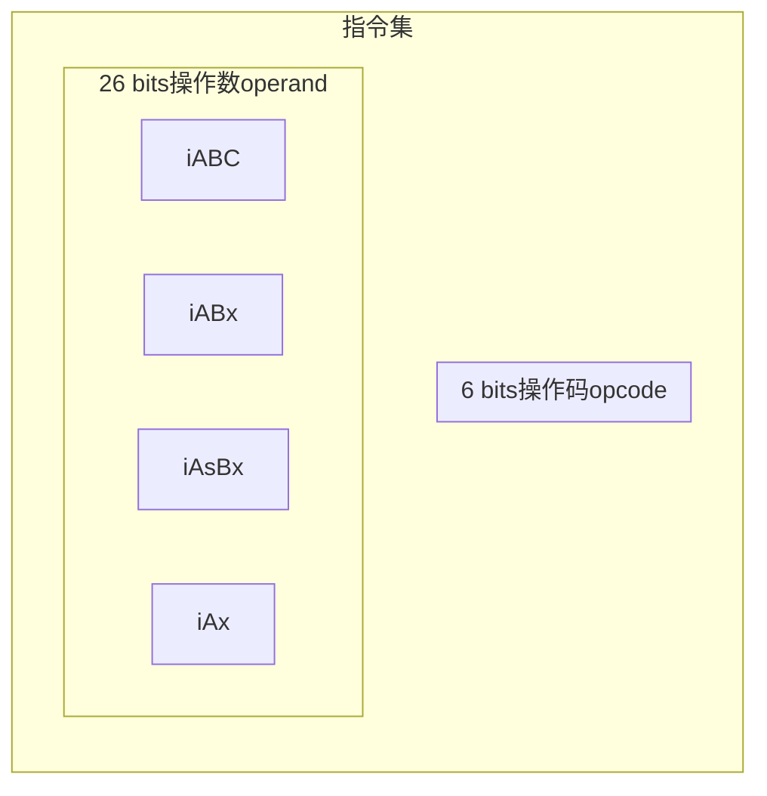
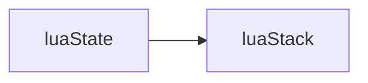
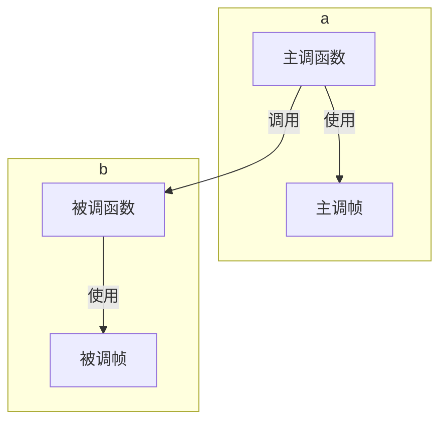

# javalua

## 第一部分 准备

### 第1章 准备工作

Use Java to write lua interpreter

学习 [自己动手实现Lua](https://book.douban.com/subject/30348061/)

环境：
* Java 11
* maven 3.6.3

为了简化代码，用了 lombok，如果运行测试失败，需要maven clean一下再跑

工具：

* 反编译 https://youtu.be/2LPaqYFPrfY https://github.com/viruscamp/luadec
* `luac53 -l -`，然后输入lua代码，按`Ctrl + Z`结束输入，可以得到反编译后的结果

## 第二部分 Lua虚拟机和Lua API

### 第2章 二进制chunk

如果luac指定了`-s`，那么行号表，局部变量表和Upvalue表，不会生成在chunk中，它们都是调试信息

书里用的lua版本是5.3.4 由于5.4的header发生变动，因此踩了坑，所以这里代码也改为实现5.3

截至commit [e354c6355e7f48e087678ec49e340ca0696725b1](https://github.com/lua/lua/tree/e354c6355e7f48e087678ec49e340ca0696725b1)

lua的官方实现中，文件如下

* lua.h 常量
* ldump.c 编码实现
* lundump.c 解码实现
* lobject.h 数据结构

本机也是little endian 小端

最终的效果是，可以读取官方编译器编译出来的chunk文件

### 第3章 指令集

基于栈（Stack Based）的虚拟机：Java虚拟机、.NET CLR、Python虚拟机、Ruby YARV虚拟机

基于寄存器（Register Based）的虚拟机：安卓早期的Dalvik虚拟机，Lua虚拟机

Lua 5.0 之前是基于栈的虚拟机，5.0 开始改成了基于寄存器的虚拟机

指令集（Instruction Set）

* 定长（Fixed-width）指令集
* 变长（Variable-width）指令集

Lua用定长（Fixed-width）指令集，每条指令占4个字节，低6比特放操作码（Opcode），其余26比特放操作数（Operand）

Lua 5.3 有47条指令，6大类

* 常量加载
* 运算符
* 循环和跳转
* 函数调用
* 表操作
* Upvalue操作

4种编码模式（Mode）

* iABC：B+C+A
* iABx：Bx+A
* iAsBx：sBx+A
* iAx：Ax

| 操作数 | 占用的比特 | 介绍                             |
| ------ | ---------- | -------------------------------- |
| A      | 8          |                                  |
| B      | 9          |                                  |
| C      | 9          |                                  |
| Bx     | 18         |                                  |
| sBx    | 18         | 只有这个操作数被解释成有符号整数 |
| Ax     | 26         |                                  |

sBx可以理解成signed Bx，即有符号的Bx

操作码（Opcode）只有6位，最多产生64条指令

Lua 5.3 有 47 条，从0到46




坑记录：

byte -128 转为 int 时，如果写成

```java
byte byteValue = -128;
int intValue = byteValue;
```

intValue也是-128，但是底层的bits 从 

1000 000 

变成 

1000 0000 0000 0000 0000 0000 0000 0111，

发生重大变化，和期望的 

0000 0000 0000 0000 0000 0000 1000 000 不一样，

不应该强转，应该用 Byte.toUnsignedInt 方法来转换

### 第4章 Lua API

Lua API主要指一系列以 "lua_" 开头的C语言函数

Lua 3.1 引入 lua_State 结构体，来满足宿主环境需要同时使用多个Lua解释器实例的场景

Lua栈是宿主语言（对官方来说是C语言，对书里的示例来说是Go语言，对本工程来说是Java语言）和Lua语言进行沟通的桥梁

Lua栈里存放的是Lua值

Lua是动态类型语言，Lua代码里，变量不携带类型信息，变量的值才携带类型信息

Lua的8种数据类型：

* nil
* 布尔（boolean）
* 数字（number）
* 字符串（string）
* 表（table）
* 函数（function）
* 线程（thread）
* 用户数据（userdata）

使用type函数可以获取变量的类型

基础的类型是：nil，布尔，数字和字符串。在Java层面，可以用[Primitive Data Types](https://docs.oracle.com/javase/tutorial/java/nutsandbolts/datatypes.html)来表示，但是这个工程为了可读性，统一用reference type来表示，也就是每个类型都可以找到对应的class

当提供给Lua API一个无效索引时，那么这个无效索引对应的值的类型就是LUA_TNONE




### 第5章 Lua 运算符

25个运算符

* 8个算术运算符：`+ - * / // % ^`注意Lua里的整除（Floor Division）是将除法结果向下（负无穷方向）取整，在Java的Go中是向0方向取整；

* 6个按位运算符：`& | ~ << >>`
* 6个比较运算符（Relational）：`== > >= < <=`
* 3个逻辑运算符：`and or not`。会有短路（Short-circuit）。and 和 or的结果就是操作数之一，不会转为布尔值
* 长度运算符：`#` 1元运算符。提取字符串或者序列的长度
* 字符串拼接运算符：`..` 拼接字符串和数字

自动类型转换

注意浮点数可以转为整数且不会丢失精度的情况下，优先转为整数

字符串 -> 整数（如果不行，才使用浮点数）

### 第6章 虚拟机雏形

程序计数器（Program Counter，简称PC），用来记录正在执行的指令

Lua虚拟机指令操作数里携带的寄存器索引是从0开始的，而Lua API里的栈索引是从1开始的

Lua编译器把函数的局部变量限制在了200个以内

stack size可以调得比较大，top也可以提前setTop(xxx)配置得和寄存器数量一样

| 符号           | 含义                                                    |
| -------------- | ------------------------------------------------------- |
| R(A)           | 寄存器A                                                 |
| Kst(Bx)        | 常量表中的第N个常量                                     |
| Kst(extra arg) | LOADKX指令和EXTRAAGR指令搭配使用，指定第extra arg个常量 |
| RK(C)          | 寄存器或者常量值（R或者K），大于0xFF时表示常量表索引    |

#### FAQ

如果replace执行时，stack内仅有一个元素，如何处理？

### 第7章 表

Lua没有数组，列表，哈希表等数据结构

只有表（Table），可以直接当成数组和列表使用，也可以用来实现其它各种数据结构

本质上是关联数组（Associative Array，也叫作Dictionary或者Map）

表构造器语法和JSON语法相似

```lua
local t = {} -- 空表
local p = {x = 100, y = 200} -- 记录
```

如果表的key全部是字符串，称这个表为记录（Record）

使用表时，key不能是nil或者浮点数NaN，value可以是任意值

```lua
t[false] = nil;
t["pi"] = 3.14;
t[t] = "table";
t[10] = assert;
```

如果某个表的键全部是正整数，就称这个表为列表（List），或者数组

注意索引从1开始

数组中的nil值为洞（Hole），如果一个数组中没有洞，那么称这个数组为序列（Sequence）

由于数组使用频繁，Lua 5.0开始引入数组和哈希表来实现表

为了解决9个比特无法表示超过512的数字，造成NEWTABLE的size无法足够大，Lua使用一种叫浮点字节（Floating Point Byte）的编码方式，仅用1个字节来表示浮点数，例如，对于 eeeeexxx，当 eeeee == 0时，表示整数xxx，否则表示 (1xxx) * 2^(eeeee - 1)

LEN指令对于table取的是数组的长度，参考 page 124

### 第8章 函数调用

```lua
-- 固定参数声明，调用时可以只传一部分
function f(a, b, b)
    print(a, b, c)
end
f()
f(1, 2)
f(1, 2, 3, 4, 5)

-- 变长参数 VARARG
function f(a, ...)
    local b, c = ...
    local t = {a, ...}
    print(a, b, c, #t, ...)
end

-- 返回任意数量个返回值
function f()
    return 1, 2, 3
end
a, b = f();
a, b, c = f();
a, b, c, d = f();
```

函数调用栈（Call Stack）和Lua栈不同，里面的element是调用帧（Call Frame）

当前函数：当前正在执行的函数

当前帧：当前函数使用的调用帧



一定要写push n个element，和pop n个element的测试

### 第9章 Go函数调用

站在Lua API角度讨论时，Go函数特指用Go语言编写，可被Lua调用的函数，站在Lua语言角度讨论问题时，称Go函数为Go闭包

Java同理。Java里有jni，设计上是相似的

Go函数必须满足签名：接收一个LuaState接口类型的参数，返回一个整数

Lua注册表：一个普通的Lua表，用户可以在里面放任何Lua值，Lua全局变量在里面

通过 伪索引（pseudo-index） 访问注册表

Lua全局变量存在全局环境里，全局环境是存在注册表里的一张普通Lua表

全局环境被当成记录来使用，里面都是字符串

